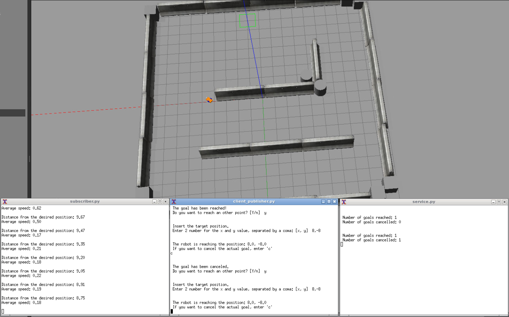
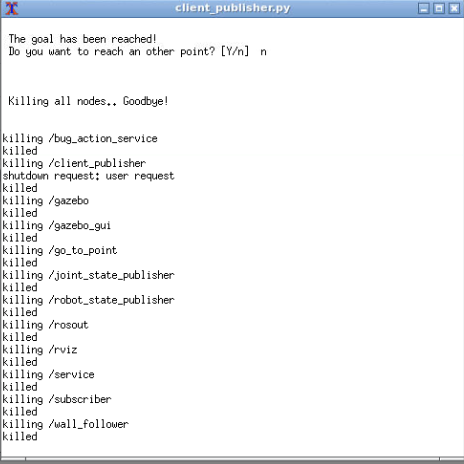
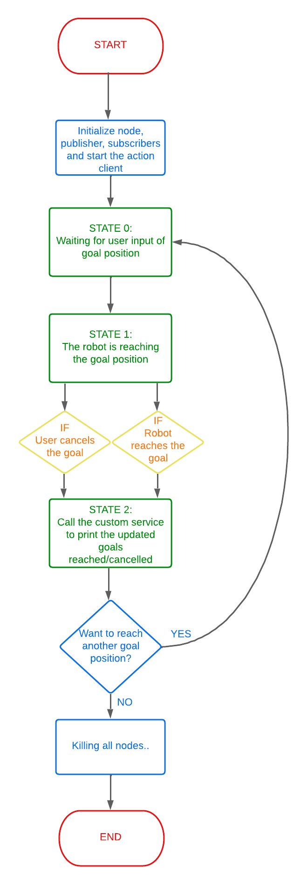

# RT1-SecondAssignment

Demaria Claudio (S5433737)

## Documentation

Doxygen documentation available at this link: https://claudiodema99.github.io/RT1-SecondAssignment/

## Description

In this assignment, we are going to use **ROS** (Robot Operating System) in order to control a mobile robot in a 3D simulation environment called *Gazebo*.  
It was provided to us an implementation of an action server that moves a robot in the environment by implementing the *bug0* algorithm.  
We have been provided with a package containing basically three ROS nodes:
- `bug_as.py`: an action server node that, once received the desired position, calls the needed services to bring the robot to the desired position, setting the position as a ROS parameter;
- `go_to_point_service.py` is the service node that, when called, makes the robot move toward the desired position, retrieved from the ROS parameter;
- `wall_follow_service.py` is the service node that, when called, makes the robot move around an obstacle (a wall, an object...);

In order to control the robot inside the simulation, we were asked to implement three nodes.  
The **first node** should allow the user to set the desired position of the robot inside of the arena or to stop the robot.  
The **second node** is a service and, when called, should print the number of positions reached and how many times the robot has been stopped.  
The **third node** should print the distance of the robot from the desired position and its average speed.

## Logic of the program 

When the launch file is executed, in addition to *Rviz* and *Gazebo*, three more screens are opened: one showing the *client_publisher* node output, another printing the *subscriber* node information, and the last printing the *service* node information.  
Initially in the *client_publisher* window (that will be our main interaction window with the program), the program asks the user to provide a set of coordinates (x,y) to define the target position.  
The robot starts moving, and while the robot is moving the user can enter a `c` character, in order to cancel the goal position.
If the user lets the robot reach the desired position, a *goal position reached* string is shown and on the *service* screen are printed the updated information about the number of goals reached/canceled.  
At this point, always in the same *client_publisher* window, the program asks if the robot wants to reach another position, and the user can reply *yes*, or *no* (Y/n).  
If the user agrees, the program restarts asking for a new set of desired coordinates.  
Otherwise, the program kills all the nodes and prints a *goodbye message*.  
If the user wants to cancel the target when the robot is moving toward the desired position, the user can enter `c` and the robot is immediately stopped, a *goal canceled string* is printed and on the *service* screen are showed the updated information about the number of goals reached/canceled.  
During all these steps, on the *subscriber* screen are continuously printed the distance between the robot and the target, and the average velocity of the robot, at the frequency set in the launch file.  
<figure>

</figure>
<br/>

**Goodbye message and killing all nodes**

<figure>

</figure>
<br/>

## My added nodes

- `client_publisher.py`: this node implements a client, a publisher and two subscribers (the name was given at the beginning of my work, only later I discover that the node would also be a subscriber..).  
We have to publish a custom message containing the robot position and velocity, so we subscribe to the `\odom` topic: in the callback, we calculate position and velocity, and we also publish the custom message with the (global) publisher.  
All the logic of the program is contained inside the *target_goal()* function.  
We have three states: in the **first state**, the program asks the user to provide a set of coordinates (x,y) to define the target position, and send the goal to the action server so the robot starts moving. In the **second state** the user can cancel the goal (entering a `c` character) or let the robot reach the desired position: in both cases, the custom server will be called at the end printing the updated number of goals reached/cancelled. In the **third state** the program asks if the robot wants to reach another position: if the user wants, the program asks for another set of coordinates to reach, otherwise the program kills all the nodes and prints a *goodbye message*.  
In order to know if the robot has reached the desired position, we need an other subscriber: we subscribe to the `reaching_goal\result` topic of the action server and we manage a boolean flag properly in order to know if the robot has reached the goal.
- `subscriber.py`: this node implements a subscriber to our custom message and in the callback, it calculates the distance from the desired position and the average speed and it prints these informations at an established frequency, given as a paramether by the launch file.
- `service.py`: this node implements a custom service that prints the number of goals reached/cancelled.  
In order to know if the robot has reached the goal position, the node has to subscribe to the `reaching_goal\result` topic of the action server.  

**Flowchart of the 'client_publisher.py' node**
<figure>

</figure>

## My custom message and service

I have defined a custom message for the `\my_pos_vel` topic and a `Goals_number.srv` service, contained respectively within the `\msg` and `\srv` folder.  

**Custom message**
```python
	float64 x
	float64 y
	float64 vel_x
	float64 vel_y
```
**Custom service**
```python
	# Request
	int32 input
	---
	# Response
	int32 reached
	int32 cancelled
```

## Install and run

First of all, you need to run the master by typing:

    roscore

To install the module, you need to go inside the `src` folder of your ROS workspace and run the following command:

    git clone https://github.com/claudioDema99/RT1-SecondAssignment

and from the root directory of your ROS workspace run the command:

    catkin_make

To run the program, you need to have installed in your system the program **xterm**. To install it, run:

    sudo apt-get install xterm

Finally, to run the code, type the following command:

    roslaunch assignment_2_2022 assignment1.launch

## Possible improvements

The first thing you notice when running the program is that when a desired position is entered, it is not clear where in the arena this point is: we can simply put a marker inside the arena simulation in order to make this clear.  
In this way the user can also notice if the entered position is involuntarily near or inside a wall.  
Another possible improvement is modifying the algorithm that control the movement of the robot, because it seems to be very basic. For example, if the robot finds a wall while moving to the desired position, it overcomes it always going around it clockwise, sometimes getting further from the goal.

